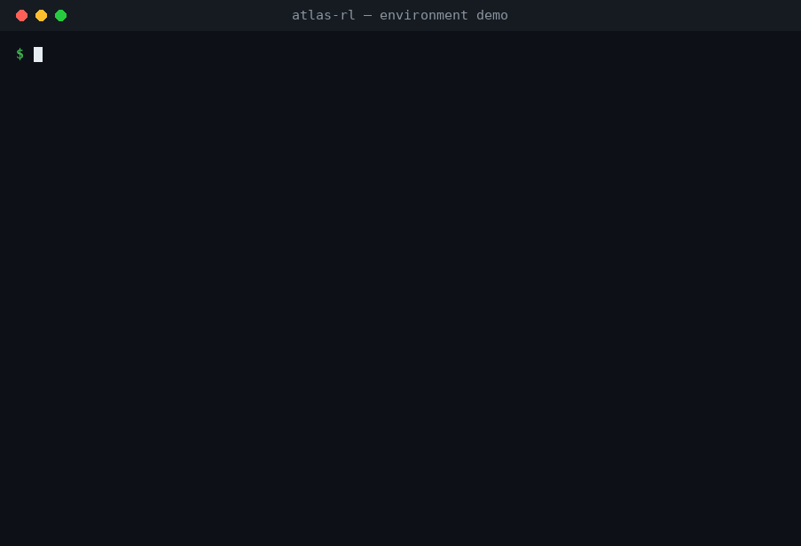
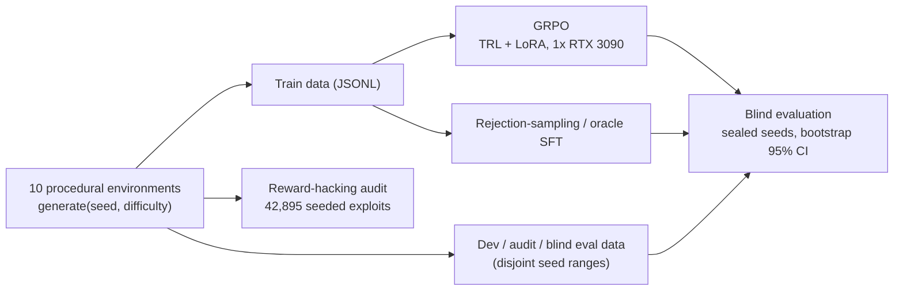

<div align="center">

# Atlas-RL

**A verifiable DevOps/SRE reasoning benchmark and RL training pipeline - every answer is checked by code, not graded by preference.**

[](pyproject.toml)
[](LICENSE)
[-orange)](requirements-train.txt)
[](pyproject.toml)

[Results](#results) | [How it works](#how-it-works) | [Environments](#environments) | [Quickstart](#quickstart-cpu-only) | [Evaluate your model](#evaluate-your-own-model) | [Train](#training) | [Cite](#citation)

</div>

---

<p align="center">
  
</p>

GRPO training on **a single 24 GB RTX 3090** takes Qwen2.5-3B from **23% -> 80%** blind pass@1 on held-out ops tasks - level with a 32B dense baseline (81%). The same pipeline takes Qwen3-4B from **54% -> 88%**, ahead of a 30B-A3B MoE baseline (67%). Every number comes from sealed blind seed ranges with bootstrap confidence intervals, and a reward-hacking audit of **42,895 seeded exploits catches all 42,895**.

Atlas-RL is ten deterministic, procedurally generated environments for DevOps/SRE reasoning - log triage, config repair, cron authoring, Kubernetes manifest repair, and more - plus the full training and evaluation stack around them:

- **Verifiable by construction.** Each environment has seeded instance generation, an oracle solution, a programmatic verifier with partial credit, and strict pass/fail scoring. Format compliance never counts as correctness.
- **Semantic verification, not string matching.** Equivalent answers pass: a cron expression is checked by simulating its fire times over a 4-week window, not by comparing text.
- **Reward-hacking defenses built in.** Every environment ships exploit canaries (degenerate, over-broad, or field-swapped answers) that the reward function must cap at <= 0.25.
- **Contamination-free evaluation.** Train, dev, audit, and final blind seed ranges are disjoint; blind ranges were only opened after model and config selection.
- **Cheap to run.** The core package needs three dependencies and no GPU; the whole data->eval->report pipeline smoke-tests on a laptop CPU. Training fits on one RTX 3090.

## Results

Headline numbers are from fixed blind seed ranges, evaluated only after model and configuration selection. Protocols: [`configs/final_blind_eval.yaml`](configs/final_blind_eval.yaml) and [`configs/qwen3_family/final_blind_eval.yaml`](configs/qwen3_family/final_blind_eval.yaml).

| blind run | model                  | pass@1 [95% CI]  | mean reward |
| --------- | ---------------------- | ---------------- | ----------- |
| Qwen2.5   | Qwen2.5-3B base        | 23% [15, 31]     | 0.303       |
| Qwen2.5   | Qwen2.5-3B stable GRPO | **80% [72, 87]** | **0.901**   |
| Qwen2.5   | Qwen2.5-32B base       | 81% [73, 88]     | 0.889       |
| Qwen3     | Qwen3-4B base          | 54% [44, 64]     | 0.682       |
| Qwen3     | Qwen3-4B oracle SFT    | **88% [81, 94]** | **0.939**   |
| Qwen3     | Qwen3-4B stable GRPO   | **88% [81, 94]** | **0.939**   |
| Qwen3     | Qwen3-30B-A3B base     | 67% [58, 76]     | 0.808       |

**How to read this honestly:**

- The Qwen2.5 run is a **+57-point** blind pass@1 gain over the 3B base. It does *not* support a claim that the trained 3B beats the 32B dense baseline - the final blind scores were 80% vs 81%.
- The Qwen3 run shows the pipeline transferring unchanged to a newer model family. Both trained 4B checkpoints reached 88% and beat the 30.5B-total / 3.3B-active MoE baseline on the sealed blind suite. Since that baseline activates *fewer* parameters per token than the 4B dense model, it is not a larger-active-parameter comparison.
- The reward-hacking audit catches **42,895 / 42,895** seeded exploit cases.

## How it works



Every environment implements the same contract: `generate(seed, difficulty)` deterministically produces an instance with a prompt, ground truth, and difficulty metadata; `oracle(instance)` produces a known-good answer; `verify(instance, response)` returns a reward breakdown with partial credit, a strict success bit, and hack flags. The GRPO reward adapter, rejection-sampling SFT, evaluation, and audit all consume this one interface.

### Design contracts

These invariants are enforced by the test suite, not just documented:

- Train, development, audit, and final blind seed ranges are disjoint.
- `generate(seed, difficulty)` is deterministic.
- Strict success requires a parseable and semantically exact answer.
- Format reward does not count as task correctness.
- Every canary must score at most `0.25` and must not pass.
- Difficulty metadata is monotonic across levels 1-5.

## Environments

Ten single-turn environments, each with difficulty dials 1-5:

| Environment       | Task                                                          |
| ----------------- | ------------------------------------------------------------- |
| `log_triage`      | Root-cause service and failure classification from logs       |
| `config_repair`   | YAML config repair against a schema                           |
| `ci_doctor`       | CI failure triage                                             |
| `runbook_planner` | Incident runbook ordering under preconditions                 |
| `shell_golf`      | One-line shell pipeline synthesis in a sandboxed VFS          |
| `cron_author`     | Natural-language scheduling to cron, checked by simulation    |
| `regex_extract`   | Regex authoring against positive and negative examples        |
| `dockerfile_lint` | Policy-violation detection                                    |
| `k8s_doctor`      | Kubernetes manifest repair through restricted patch ops       |
| `semver_resolve`  | Dependency resolution under semver constraints                |

### A task, up close

`cron_author`, difficulty 4, seed 7 - the exact instance in the GIF above. The model sees an operations request:

> Translate this operations request into a standard 5-field cron expression
> (minute hour day-of-month month day-of-week; day-of-week 0=Sunday..6=Saturday):
>
> **Request:** Run the exporter every 20 minutes from 08:00 through 15:59 on weekdays (Monday to Friday) only.
>
> Notes: any expression that fires at exactly the requested times is accepted (equivalent forms are fine).

A correct answer (inside `<answer>` tags) is `*/20 8-15 * * 1-5` - but so is any equivalent form like `0,20,40 8-15 * * 1-5`. The verifier doesn't compare strings; it simulates both expressions' fire times over a fixed 4-week window and compares the fire *sets*. Partial credit is `0.7 x Jaccard^2` of the fire sets, so over-broad schedules earn little.

The environment also ships canaries - seeded exploits the reward must reject:

| Canary             | Answer        | Why a lazy reward would pay it            |
| ------------------ | ------------- | ----------------------------------------- |
| `fire_always`      | `* * * * *`   | Fires every minute, covers any schedule   |
| `swapped_fields`   | hour/minute swapped | Classic near-miss that looks right |
| `midnight_default` | `0 0 * * *`   | Generic daily guess                       |

These ride on top of generic canaries every environment is checked against: empty responses, missing answer tags, format-only answers, prompt echoes, tag spam, and oversized responses. All must score <= 0.25 and fail. Reproduce the GIF exactly: `python -m atlas_rl.demo --env cron_author --difficulty 4 --seed 7`.

## Quickstart (CPU-only)

The core install is three lightweight dependencies - no GPU, no torch.

```bash
git clone https://github.com/HassanHassnain/atlas-rl && cd atlas-rl
python3 -m venv .venv && source .venv/bin/activate
python -m pip install -e ".[dev]"

make check    # lint + unit/contract tests (determinism, verifiability, anti-hacking)
make smoke    # full CPU pipeline: datasets -> mock evals -> report -> transfer matrix -> mini audit
```

Then poke at the environments interactively:

```bash
python -m atlas_rl.demo                                   # guided tour of all ten envs
python -m atlas_rl.demo --env shell_golf --difficulty 4   # one env: prompt, oracle -> verifier, canaries
python -m atlas_rl.demo --env config_repair --interactive # paste your own answer, get scored
```

The demo prints a generated instance, scores the oracle answer, shows every canary being caught, and re-generates the instance to prove determinism.

## Evaluate your own model

`atlas-eval` (or `python -m atlas_rl.evaluation.run_eval`) evaluates any backend on freshly generated held-out instances - eval seeds live in a disjoint range from training seeds, so evaluation is contamination-free by construction.

```bash
# CPU pipeline check with the mock backend (no GPU):
atlas-eval --model mock:noisy_oracle:0.6 --n-per-env 20 --difficulties 2 3 4 --out results/mock_noisy

# A Hugging Face model:
atlas-eval --model hf:Qwen/Qwen2.5-3B-Instruct --n-per-env 100 --difficulties 2 3 4 --out results/base_3b

# A trained LoRA adapter on top of its base:
atlas-eval --model "hf:Qwen/Qwen2.5-3B-Instruct:adapter=checkpoints/grpo_3b/final" \
    --n-per-env 100 --difficulties 2 3 4 --out results/grpo_3b
```

An OpenAI-compatible backend (vLLM serve, OpenRouter, etc.) is also available - see [`atlas_rl/inference/backends.py`](atlas_rl/inference/backends.py) for the spec format. Each run writes `rows.jsonl` (per-instance responses, rewards, hack flags, latency) and `summary.json` (overall and per-env pass@1 with bootstrap 95% CIs). Use `--k` for pass@k, `--envs` to subset environments.

## Training

Training was developed and run end-to-end on a single RTX 3090 (24 GB, CUDA 12.x): TRL `GRPOTrainer` with LoRA adapters via PEFT and bitsandbytes. On the GPU machine:

```bash
python -m pip install -r requirements-train.txt   # pinned, 3090-tested versions
bash scripts/01_build_datasets.sh                 # deterministic train/eval JSONL data
```

Then run the measured experiment entrypoints:

```bash
bash scripts/10_train_grpo_pilot_1p5b.sh     # GRPO pilot (1.5B)
bash scripts/11_train_grpo_3b.sh             # main GRPO run on Qwen2.5-3B
bash scripts/12_train_sft_rs.sh              # rejection-sampling SFT baseline
bash scripts/13_train_transfer.sh            # cross-environment transfer study
bash scripts/14_train_oracle_warm_grpo.sh    # oracle-SFT warm start + GRPO
bash scripts/20_eval_matrix.sh               # evaluation matrix
bash scripts/21_transfer_matrix.sh           # transfer matrix
bash scripts/22_hacking_audit.sh             # reward-hacking audit
```

Generated datasets, checkpoints, and reports live under `data/generated/`, `checkpoints/`, `results/`, and `misc/`; these are intentionally excluded from the repository. Note: `trl` is pinned (`==0.17.0`) because `grpo_train.py` relies on its reward-function signature - see [`requirements-train.txt`](requirements-train.txt) before upgrading.

## Repository layout

```text
atlas_rl/
  core/             protocol, types, seeding, registry
  envs/             procedural environments and verifiers
  training/         GRPO, reward adapter, rejection-sampling SFT
  evaluation/       evaluation, statistics, reports, transfer study
  rewards/          reward-hacking audit
  inference/        mock, Hugging Face, OpenAI-compatible backends
configs/            experiment configs and blind protocols
scripts/            numbered experiment entrypoints
tests/              verifier and pipeline contracts
```

Installing the package also exposes console scripts: `atlas-demo`, `atlas-data`, `atlas-eval`, `atlas-report`, `atlas-transfer`, `atlas-audit`, `atlas-train-grpo`, `atlas-sft-rs`.

## Adding an environment

Environments self-register and inherit the shared contract:

```python
from atlas_rl.core.env import AtlasEnv
from atlas_rl.core.registry import register

@register
class MyEnv(AtlasEnv):
    env_id = "my_env"
    name = "My verifiable task"
    answer_format = "what a well-formed answer looks like"
    difficulty_dials = {"knob": "easy -> hard"}

    def _build(self, rng, difficulty):   # -> (prompt, ground_truth, metadata)
        ...
    def verify(self, instance, response):  # -> RewardBreakdown
        ...
    def oracle(self, instance):          # -> known-good answer
        ...
    def extra_canaries(self, instance):  # -> seeded exploits to catch
        ...
```

Run `make check` - the contract tests (determinism, canary caps <= 0.25, monotonic difficulty) apply to every registered environment automatically.

## Citation

```bibtex
@software{hasnain2026atlasrl,
  author = {Hasnain, Hassan},
  title  = {Atlas-RL: A Verifiable DevOps/SRE RL Benchmark and Training Pipeline},
  year   = {2026},
  url    = {https://github.com/HassanHassnain/atlas-rl}
}
```

## License

MIT - see [LICENSE](LICENSE).
